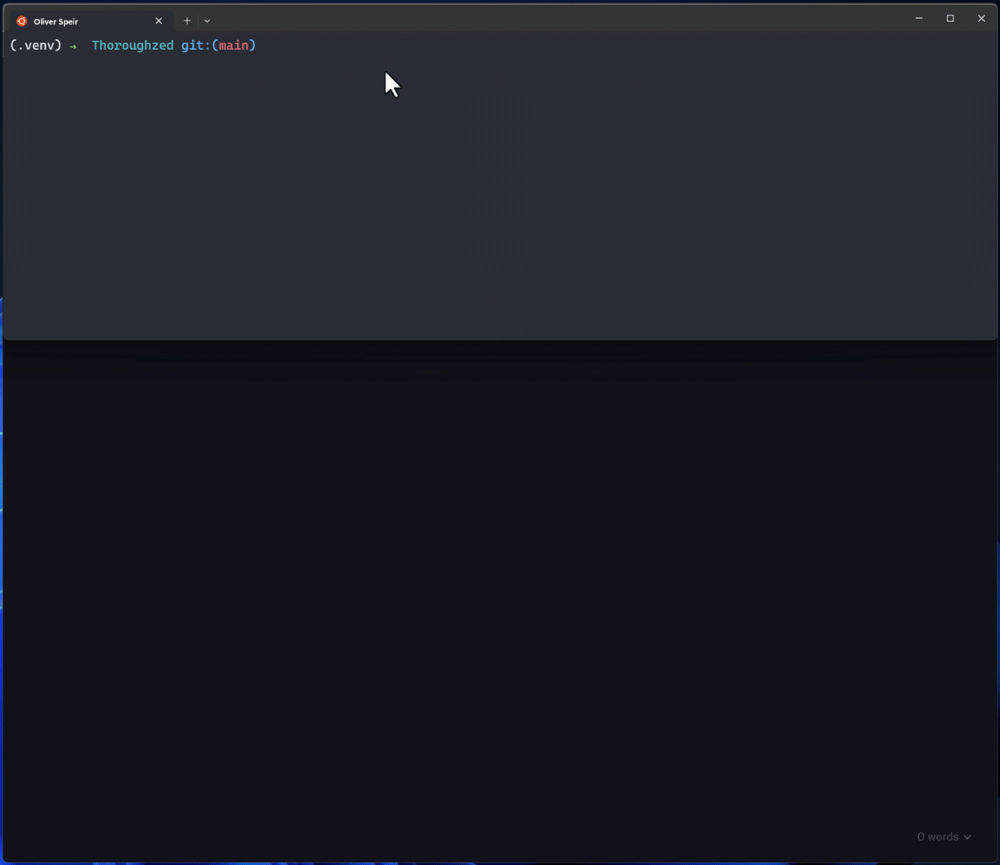

# ThoroughZED

The number one tool for valuing NFT horses on the [ZED RUN](https://zed.run/) digital horse racing platform.

## Our Team

- [Harper Foley](https://github.com/hfoley2013)
- [Jason Christopher](https://github.com/jason-christopher)
- [Oliver Speir](https://github.com/OliverSpeir)
- [Dennis Nichols](https://github.com/dennis-nichols)

## Application Features

- Interactive [Panel](https://panel.holoviz.org/) Dashboard
- Random Forest Machine Learning price estimation trained on ZED RUN market data
- Intrinsic value estimation of horses and predicted earnings using 'Discount Cash Flow' analysis.
  - See Harper's [article](https://rainierracingco.medium.com/how-to-value-a-zed-run-horse-fa8f3384ee54) on this method.
- Command Line Interface that calculates estimations or launches dashboard

## How to run

- clone repo
- `pip install -r requirements.txt`
- `python -m app.train_model`
- `python -m app.main`

### Demo

